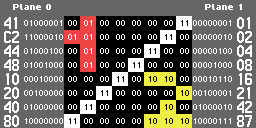
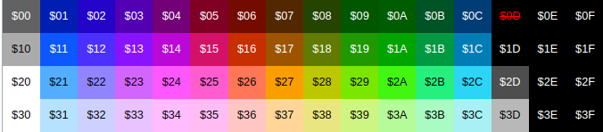
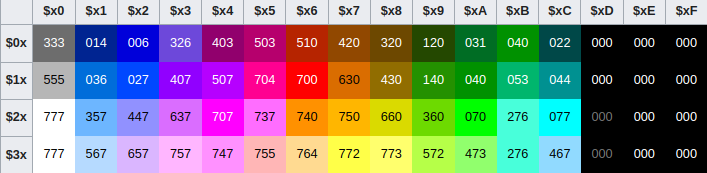

# ref

https://www.nesdev.org/wiki/PPU

# description
  The NES PPU, or Picture Processing Unit, generates a composite video signal with 240 lines of pixels, designed to be received by a television. When the Famicom chipset was designed in the early 1980s, it was considered quite an advanced 2D picture generator for video games.

  It has its own address space, which typically contains 10 kilobytes of memory: 8 kilobytes of ROM or RAM on the Game Pak (possibly more with one of the common mappers) to store the shapes of background and sprite tiles, plus 2 kilobytes of RAM in the console to store a map or two. Two separate, smaller address spaces hold a palette, which controls which colors are associated to various indices, and OAM (Object Attribute Memory), which stores the position, orientation, shape, and color of the sprites, or independent moving objects. These are internal to the PPU itself, and while the palette is made of static memory, OAM uses dynamic memory (which will slowly decay if the PPU is not rendering).

     ________
    |  PPU   |                                                         BUS
    |________|================================================================================>     
                    ||                              ||                       ||
                    ||                              ||                       || 
                    \/                              \/                       \/
    __________________________         __________________________           ________________
    | Pattern table "CHR ROM" |        | Nametable Memory  "vram" |         | Palette Memory | 
    |____0x0000 to 0x1FFF_____|        |__0x2000 to 0x3EFF________|         |0x3F00 to 0x3FFF|

# pattern table:
  The pattern table is an area of memory connected to the PPU that defines the shapes of tiles that make up backgrounds and sprites.  
  This data is also known as CHR, and the memory attached to the PPU which contains it may either be CHR-ROM or CHR-RAM. CHR comes from "character", as related to computer text displays where each tile might represent a single letter character.

  Each tile in the pattern table is 16 bytes, made of two planes. Each bit in the first plane controls bit 0 of a pixel's color color; the corresponding bit in the second plane controls bit 1.

  - If neither bit is set to 1: The pixel is background/transparent.
  - If only the bit in the first plane is set to 1: The pixel's color index is 1.
  - If only the bit in the second plane is set to 1: The pixel's color index is 2.
  - If both bits are set to 1: The pixel's color index is 3.

  

  This diagram depicts how a tile for ½ (one-half fraction) is encoded, with . representing a transparent pixel.

    Bit Planes                 Pixel Pattern
    $0xx0=$41  01000001
    $0xx1=$C2  11000010
    $0xx2=$44  01000100
    $0xx3=$48  01001000
    $0xx4=$10  00010000          
    $0xx5=$20  00100000         .1.....3
    $0xx6=$40  01000000         11....3.
    $0xx7=$80  10000000  =====  .1...3..
                                .1..3...
    $0xx8=$01  00000001  =====  ...3.22.
    $0xx9=$02  00000010         ..3....2
    $0xxA=$04  00000100         .3....2.
    $0xxB=$08  00001000         3....222
    $0xxC=$16  00010110
    $0xxD=$21  00100001
    $0xxE=$42  01000010
    $0xxF=$87  10000111

  The pattern table is divided into two 256-tile sections: $0000-$0FFF, nicknamed "left", and $1000-$1FFF, nicknamed "right". The nicknames come from how emulators with a debugger display the pattern table. Traditionally, they are displayed as two side-by-side 128x128 pixel sections, each representing 16x16 tiles from the pattern table, with $0000-$0FFF on the left and $1000-$1FFF on the right.

  An important aspect of a mapper's capability is how finely it allows bank switching parts of the pattern table.

  ## Addressing
  PPU addresses within the pattern tables can be decoded as follows:

    DCBA98 76543210
    ---------------
    0HRRRR CCCCPTTT
    |||||| |||||+++- T: Fine Y offset, the row number within a tile
    |||||| ||||+---- P: Bit plane (0: "lower"; 1: "upper")
    |||||| ++++----- C: Tile column
    ||++++---------- R: Tile row
    |+-------------- H: Half of pattern table (0: "left"; 1: "right")
    +--------------- 0: Pattern table is at $0000-$1FFF

  The value written to PPUCTRL ($2000) controls whether the background and sprites use the left half ($0000-$0FFF) or the right half ($1000-$1FFF) of the pattern table. PPUCTRL bit 4 applies to backgrounds, bit 3 applies to 8x8 sprites, and bit 0 of each OAM entry's tile number applies to 8x16 sprites.

  For example, if rows of a tile are numbered 0 through 7, row 1 of tile $69 in the left pattern table is stored with plane 0 in $0691 and plane 1 in $0699.

# Nametable:
  A nametable is a 1024 byte area of memory used by the PPU to lay out backgrounds. Each byte in the nametable controls one 8x8 pixel character cell, and each nametable has 30 rows of 32 tiles each, for 960 ($3C0) bytes; the rest is used by each nametable's attribute table. With each tile being 8x8 pixels, this makes a total of 256x240 pixels in one map, the same size as one full screen.

  ## Mirroring
  The NES has four logical nametables, arranged in a 2x2 pattern. Each occupies a 1 KiB chunk of PPU address space, starting at $2000 at the top left, $2400 at the top right, $2800 at the bottom left, and $2C00 at the bottom right.

  But the NES system board itself has only 2 KiB of VRAM (called CIRAM, stored in a separate SRAM chip), enough for two physical nametables; hardware on the cartridge controls address bit 10 of CIRAM to map one nametable on top of another.

  
  - ertical mirroring: $2000 equals $2800 and $2400 equals $2C00 (e.g. Super Mario Bros.)
  
  - Horizontal mirroring: $2000 equals $2400 and $2800 equals $2C00 (e.g. Kid Icarus)
  
  - One-screen mirroring: All nametables refer to the same memory at any given time, and the mapper 
  directly manipulates CIRAM address bit 10 (e.g. many Rare games using AxROM)
  
  - Four-screen mirroring: CIRAM is disabled, and the cartridge contains additional VRAM used for all nametables (e.g. Gauntlet, Rad Racer 2)
  
  - Other: Some advanced mappers can present arbitrary combinations of CIRAM, VRAM, or even CHR ROM in the nametable area. Such exotic setups are rarely used.
  
                (0,0)     (256,0)     (511,0)
                  +-----------+-----------+
                  |           |           |
                  |           |           |
                  |   $2000   |   $2400   |
                  |           |           |
                  |           |           |
            (0,240)+-----------+-----------+(511,240)
                  |           |           |
                  |           |           |
                  |   $2800   |   $2C00   |
                  |           |           |
                  |           |           |
                  +-----------+-----------+
                (0,479)   (256,479)   (511,479)

  ## Background evaluation
  Conceptually, the PPU does this 33 times for each scanline:

  1. Fetch a nametable entry from $2000-$2FBF.
  
  2. Fetch the corresponding attribute table entry from $23C0-$2FFF and increment the current VRAM address within the same row.
  
  3. Fetch the low-order byte of an 8x1 pixel sliver of pattern table from $0000-$0FF7 or $1000-$1FF7.
  
  4. Fetch the high-order byte of this sliver from an address 8 bytes higher.
  
  5. Turn the attribute data and the pattern table data into palette indices, and combine them with data from sprite data using priority.
  
  6. It also does a fetch of a 34th (nametable, attribute, pattern) tuple that is never used, but some mappers rely on this fetch for timing purposes.

# Pallete Memory:
  The NES has a limited selection of color outputs. A 6-bit value in the palette memory area corresponds to one of 64 outputs. The emphasis bits of the PPUMASK register ($2001) provide an additional color modifier.

  ## Memory Map
  The palette for the background runs from VRAM $3F00 to $3F0F; the palette for the sprites runs from $3F10 to $3F1F. Each color takes up one byte.

    Address	            Purpose
    $3F00	              Universal background color
    $3F01-$3F03	        Background palette 0
    $3F05-$3F07	        Background palette 1
    $3F09-$3F0B	        Background palette 2
    $3F0D-$3F0F	        Background palette 3
    $3F10	              Mirrorof universal background color
    $3F11-$3F13	        Sprite palette 0
    $3F15-$3F17	        Sprite palette 1
    $3F19-$3F1B	        Sprite palette 2
    $3F1D-$3F1F	        Sprite palette 3

  Each palette has three colors. Each 16x16 pixel area of the background can use the backdrop color and the three colors from one of the four background palettes. The choice of palette for each 16x16 pixel area is controlled by bits in the attribute table at the end of each nametable. Each sprite can use the three colors from one of the sprite palettes. The choice of palette is in attribute 2 of each sprite
  
  Addresses $3F04/$3F08/$3F0C can contain unique data, though these values are not used by the PPU when normally rendering (since the pattern values that would otherwise select those cells select the backdrop color instead). They can still be shown using the background palette hack, explained below.

  Addresses $3F10/$3F14/$3F18/$3F1C are mirrors of $3F00/$3F04/$3F08/$3F0C. Note that this goes for writing as well as reading. A symptom of not having implemented this correctly in an emulator is the sky being black in Super Mario Bros., which writes the backdrop color through $3F10.

  Thus, indices into the palette are formed as follows:
  
    43210
    |||||
    |||++- Pixel value from tile data
    |++--- Palette number from attribute table or OAM
    +----- Background/Sprite select

  As in some second-generation game consoles, values in the NES palette are based on hue and brightness:

    76543210
    ||||||||
    ||||++++- Hue (phase, determines NTSC/PAL chroma)
    ||++----- Value (voltage, determines NTSC/PAL luma)
    ++------- Unimplemented, reads back as 0

  Hue $0 is light gray, $1-$C are blue to red to green to cyan, $D is dark gray, and $E-$F are mirrors of $1D (black).

  It works this way because of the way colors are represented in a composite NTSC or PAL signal, with the phase of a color subcarrier controlling the hue. For details regarding signal generation and color decoding, see NTSC video.

  The canonical code for "black" is $0F or $1D.

  The 2C03 RGB PPU used in the PlayChoice-10 and Famicom Titler renders hue $D as black, not dark gray. The 2C04 PPUs used in many Vs. System arcade games have completely different palettes as a copy protection measure.

  ## PAlletes
  The 2C02 (NTSC) and 2C07 (PAL) PPU is used to generate an analog composite video signal. These were used in most home consoles.

  The 2C03, 2C04, and 2C05, on the other hand, all output analog red, green, blue, and sync (RGBS) signals. The sync signal contains horizontal and vertical sync pulses in the same format as an all-black composite signal. Each of the three video channels uses a 3-bit DAC driven by a look-up table in a 64x9-bit ROM inside the PPU. The look-up tables (one digit for each of red, green, and blue, in order) are given below.

  RGB PPUs were used mostly in arcade machines (e.g. Vs. System, Playchoice 10), as well as the Sharp Famicom Titler.

  - 2C02:
    The RF Famicom, AV Famicom, NES (both front- and top-loading), and the North American version of the Sharp Nintendo TV use the 2C02 PPU. Unlike some other consoles' video circuits, the 2C02 does not generate RGB video and then encode that to composite. Instead it generates NTSC video directly in the composite domain, decoded by the television receiver into RGB to drive its picture tube.

    Most emulators can use a predefined palette, such as one commonly stored in common .pal format, in which each triplet represents the sRGB color that results from decoding a large flat area with a given palette value. The following palette was generated using Persune's palette generator @v0.5.1 with the following arguments: palgen-persune.py -phs -5.0 -blp 0.0 -o 2C02G.pal

    

    Other tools for generating a palette include one by Bisqwit and one by Drag. These simulate generating a large area of one flat color and then decoding that with the adjustment knobs set to various settings
  

  - 2C07: 
    The PAL PPU (2C07) generates a composite PAL video signal, which has a -15 degree hue shift relative to the 2C02 due to a different colorburst reference phase generated by the PPU ($x7 rather than $x8), in addition to the PAL colorburst phase being defined as -U ± 45 degrees. The following palette was generated using Persune's palette generator @v0.5.1 with the following arguments: palgen-persune.py -blp 0.0 -cbr 7 -pal -o 2C07.pal

    

  - 2C03 and 2C05:
    This palette is intentionally similar to the NES's standard palette, but notably is missing the greys in entries $2D and $3D. The 2C03 is used in Vs. Duck Hunt, Vs. Tennis, all PlayChoice games, the Famicom Titler, and the Famicom TV. The 2C05 is used in some later Vs. games as a copy protection measure. Both have been used in RGB mods for the NES, as a circuit implementing A0' = A0 xor (A1 nor A2) can swap PPUCTRL and PPUMASK to make a 2C05 behave as a 2C03.
    The formula for mapping the DAC integer channel value to 8-bit per channel color is C = 255 * DAC / 7.

    

    Note that some of the colors are duplicates: $0B and $1A = 040, $2B and $3B = 276.

    Kevtris's dumped palettes imply that the monochrome bit has unique function on the 2C03 and 2C05: instead of just using the leftmost column of the palette (and forcing the lower four bits to zero), instead the top two bits index into a palette with colors: 000, 333, 777, 777. Given that the 2C04 does not do this, this exception feels weird, and corroboration would be appreciated.

  ## LUT approach
  Emulator authors may implement the 2C04 variants as a LUT indexing the "ordered" palette. This has the added advantage of being able to use preexisting .pal files if the end user wishes to do so.

  Repeating colors such as 000 and 777 may index into the same entry of the "ordered" palette, as this is functionally identical.

    const unsigned char PaletteLUT_2C04_0001 [64] ={
      0x35,0x23,0x16,0x22,0x1C,0x09,0x1D,0x15,0x20,0x00,0x27,0x05,0x04,0x28,0x08,0x20,
      0x21,0x3E,0x1F,0x29,0x3C,0x32,0x36,0x12,0x3F,0x2B,0x2E,0x1E,0x3D,0x2D,0x24,0x01,
      0x0E,0x31,0x33,0x2A,0x2C,0x0C,0x1B,0x14,0x2E,0x07,0x34,0x06,0x13,0x02,0x26,0x2E,
      0x2E,0x19,0x10,0x0A,0x39,0x03,0x37,0x17,0x0F,0x11,0x0B,0x0D,0x38,0x25,0x18,0x3A
    };

    const unsigned char PaletteLUT_2C04_0002 [64] ={
        0x2E,0x27,0x18,0x39,0x3A,0x25,0x1C,0x31,0x16,0x13,0x38,0x34,0x20,0x23,0x3C,0x0B,
        0x0F,0x21,0x06,0x3D,0x1B,0x29,0x1E,0x22,0x1D,0x24,0x0E,0x2B,0x32,0x08,0x2E,0x03,
        0x04,0x36,0x26,0x33,0x11,0x1F,0x10,0x02,0x14,0x3F,0x00,0x09,0x12,0x2E,0x28,0x20,
        0x3E,0x0D,0x2A,0x17,0x0C,0x01,0x15,0x19,0x2E,0x2C,0x07,0x37,0x35,0x05,0x0A,0x2D
    };

    const unsigned char PaletteLUT_2C04_0003 [64] ={
        0x14,0x25,0x3A,0x10,0x0B,0x20,0x31,0x09,0x01,0x2E,0x36,0x08,0x15,0x3D,0x3E,0x3C,
        0x22,0x1C,0x05,0x12,0x19,0x18,0x17,0x1B,0x00,0x03,0x2E,0x02,0x16,0x06,0x34,0x35,
        0x23,0x0F,0x0E,0x37,0x0D,0x27,0x26,0x20,0x29,0x04,0x21,0x24,0x11,0x2D,0x2E,0x1F,
        0x2C,0x1E,0x39,0x33,0x07,0x2A,0x28,0x1D,0x0A,0x2E,0x32,0x38,0x13,0x2B,0x3F,0x0C
    };

    const unsigned char PaletteLUT_2C04_0004 [64] ={
        0x18,0x03,0x1C,0x28,0x2E,0x35,0x01,0x17,0x10,0x1F,0x2A,0x0E,0x36,0x37,0x0B,0x39,
        0x25,0x1E,0x12,0x34,0x2E,0x1D,0x06,0x26,0x3E,0x1B,0x22,0x19,0x04,0x2E,0x3A,0x21,
        0x05,0x0A,0x07,0x02,0x13,0x14,0x00,0x15,0x0C,0x3D,0x11,0x0F,0x0D,0x38,0x2D,0x24,
        0x33,0x20,0x08,0x16,0x3F,0x2B,0x20,0x3C,0x2E,0x27,0x23,0x31,0x29,0x32,0x2C,0x09
    };

  ## Backdrop color (palette index 0) uses
  During forced blanking, when neither background nor sprites are enabled in PPUMASK ($2001), the picture will show the backdrop color. If only the background or sprites are disabled, or if the left 8 pixels are clipped off, the PPU continues its normal video memory access pattern but uses the backdrop color for anything disabled.

  ## The background palette hack
  During forced blanking, if the current VRAM address ever points to a palette register (i.e., $3F00-$3FFF), then the color in that palette register will be output to the screen instead of the backdrop color, for as long as the VRAM address is pointing there during the forced blanking. This can be used to display colors from the normally unused $3F04/$3F08/$3F0C palette locations. (Looking at the relevant circuitry in Visual 2C02, this happens because the palette RAM's output is not disconnected from the video output circuitry when not rendering.)

  A loop that fills the palette will cause each color in turn to be shown on the screen, so to avoid rainbow artifacts while loading the palette, wait for a real vertical blank first using an NMI technique.

  ## Color names
  When programmers and artists are communicating, it's often useful to have human-readable names for colors. Many graphic designers who have done web or game work will be familiar with HTML color names.

  1. Luma

    - $0F: Black
    - $00: Dark gray
    - $10: Light gray or silver
    - $20: White
    - $01-$0C: Dark colors, medium mixed with black
    - $11-$1C: Medium colors, similar brightness to dark gray
    - $21-$2C: Light colors, similar brightness to light gray
    - $31-$3C: Pale colors, light mixed with white

  2. Chroma

    Names for hues:
    
    - $x0: Gray
    - $x1: Azure
    - $x2: Blue
    - $x3: Violet
    - $x4: Magenta
    - $x5: Rose
    - $x6: Red or maroon
    - $x7: Orange
    - $x8: Yellow or olive
    - $x9: Chartreuse
    - $xA: Green
    - $xB: Spring
    - $xC: Cyan
  
  3. RGBI

    These NES colors approximate colors in 16-color RGBI palettes, such as the CGA, EGA, or classic Windows palette, though the NES doesn't really have particularly good approximations:

    - $0F: 0/Black
    - $02: 1/Navy
    - $1A: 2/Green
    - $1C: 3/Teal
    - $06: 4/Maroon
    - $14: 5/Purple
    - $18: 6/Olive ($17 for the brown in CGA/EGA in RGB)
    - $10: 7/Silver
    - $00: 8/Gray
    - $12: 9/Blue
    - $2A: 10/Lime
    - $2C: 11/Aqua/Cyan
    - $16: 12/Red
    - $24: 13/Fuchsia/Magenta
    - $28: 14/Yellow
    - $30: 15/White

# PPU memory map

  PPU memory map
  The PPU addresses a 14-bit (16kB) address space, $0000-3FFF, completely separate from the CPU's address bus. It is either directly accessed by the PPU itself, or via the CPU with memory mapped registers at $2006 and $2007.

  The NES has 2kB of RAM dedicated to the PPU, normally mapped to the nametable address space from $2000-2FFF, but this can be rerouted through custom cartridge wiring.

    Address range 	Size	    Description
    $0000-$0FFF	    $1000   	Pattern table 0
    $1000-$1FFF	    $1000   	Pattern table 1
    $2000-$23FF	    $0400   	Nametable 0
    $2400-$27FF	    $0400   	Nametable 1
    $2800-$2BFF	    $0400   	Nametable 2
    $2C00-$2FFF	    $0400   	Nametable 3
    $3000-$3EFF	    $0F00   	Mirrors of $2000-$2EFF
    $3F00-$3F1F	    $0020   	Palette RAM indexes
    $3F20-$3FFF	    $00E0   	Mirrors of $3F00-$3F1F

  In addition, the PPU internally contains 256 bytes of memory known as Object Attribute Memory which determines how sprites are rendered. The CPU can manipulate this memory through memory mapped registers at OAMADDR ($2003), OAMDATA ($2004), and OAMDMA ($4014). OAM can be viewed as an array with 64 entries. Each entry has 4 bytes: the sprite Y coordinate, the sprite tile number, the sprite attribute, and the sprite X coordinate.

  
    Address Low Nibble	    Description
    $00,$04,$08,$0C	        Sprite Y coordinate
    $01,$05,$09,$0D	        Sprite tile #
    $02,$06,$0A,$0E	        Sprite attribut
    $03,$07,$0B,$0F	        Sprite X coordiat

  ## Hardware mapping
  The mappings above are the fixed addresses from which the PPU uses to fetch data during rendering. The actual device that the PPU fetches data from, however, may be configured by the cartridge.

  - $0000-1FFF is normally mapped by the cartridge to a CHR-ROM or CHR-RAM, often with a bank switching   mechanism.

  - $2000-2FFF is normally mapped to the 2kB NES internal VRAM, providing 2 nametables with a mirroring configuration controlled by the cartridge, but it can be partly or fully remapped to RAM on the cartridge, allowing up to 4 simultaneous nametables.
  
  - $3000-3EFF is usually a mirror of the 2kB region from $2000-2EFF. The PPU does not render from this address range, so this space has negligible utility.
  
  - $3F00-3FFF is not configurable, always mapped to the internal palette control.

# PPU registers
  The PPU exposes eight memory-mapped registers to the CPU. These nominally sit at $2000 through $2007 in the CPU's address space, but because they're incompletely decoded, they're mirrored in every 8 bytes from $2008 through $3FFF, so a write to $3456 is the same as a write to $2006.

  Immediately after powerup, the PPU isn't necessarily in a usable state. The program needs to do a few things to get it going; see PPU power up state and Init code.

                                     _______
                                    |  CPU  |========================================================             
                                    |_______|                                                      ||                         
    0x2000                             | |                            0x2007                       || 
      ====================================================================                         ||                              
      ||       ||       ||         ||        ||       ||       ||       ||                         ||
      ||       ||       ||         ||        ||       ||       ||       ||                         ||
      \/       \/       \/         \/        \/       \/       \/       \/                         \/
     ______   ______   ______    _______    _______   ______   ______   ______                     ______  
    | CTRL | | Mask | |STATUS|  |OAMADDR|  |OAMDATA| |SCROLL| | ADDR | | DATA |                   |OAMDMA|
    |0x2000| |0x2001| |0x2002|  |0x2003 |  |0x2004 | |0x2005| |0x2006| |0x2007|                   |0x4014|   

  ## Ports 
  The PPU has an internal data bus that it uses for communication with the CPU. This bus, called _io_db in Visual 2C02 and PPUGenLatch in FCEUX,behaves as an 8-bit dynamic latch due to capacitance of very long traces that run to various parts of the PPU. Writing any value to any PPU port, even to the nominally read-only PPUSTATUS, will fill this latch. Reading any readable port (PPUSTATUS, OAMDATA, or PPUDATA) also fills the latch with the bits read. Reading a nominally "write-only" register returns the latch's current value, as do the unused bits of PPUSTATUS. This value begins to decay after a frame or so, faster once the PPU has warmed up, and it is likely that values with alternating bit patterns (such as $55 or $AA) will decay faster. 

  ## CTRL
  - Description: PPU control register
  - Access: write

  Various flags controlling PPU operation

    7  bit  0
    ---- ----
    VPHB SINN
    |||| ||||
    |||| ||++- Base nametable address
    |||| ||    (0 = $2000; 1 = $2400; 2 = $2800; 3 = $2C00)
    |||| |+--- VRAM address increment per CPU read/write of PPUDATA
    |||| |     (0: add 1, going across; 1: add 32, going down)
    |||| +---- Sprite pattern table address for 8x8 sprites
    ||||       (0: $0000; 1: $1000; ignored in 8x16 mode)
    |||+------ Background pattern table address (0: $0000; 1: $1000)
    ||+------- Sprite size (0: 8x8 pixels; 1: 8x16 pixels – see PPU OAM#Byte 1)
    |+-------- PPU master/slave select
    |          (0: read backdrop from EXT pins; 1: output color on EXT pins)
    +--------- Generate an NMI at the start of the vertical blanking interval (0: off; 1: on)

  Equivalently, bits 1 and 0 are the most significant bit of the scrolling coordinates

    7  bit  0
    ---- ----
    .... ..YX
          ||
          |+- 1: Add 256 to the X scroll position
          +-- 1: Add 240 to the Y scroll position

  Another way of seeing the explanation above is that when you reach the end of a nametable, you must switch to the next one, hence, changing the nametable address.

  After power/reset, writes to this register are ignored for about 30,000 cycles.

  If the PPU is currently in vertical blank, and the PPUSTATUS ($2002) vblank flag is still set (1), changing the NMI flag in bit 7 of $2000 from 0 to 1 will immediately generate an NMI. This can result in graphical errors (most likely a misplaced scroll) if the NMI routine is executed too late in the blanking period to finish on time. To avoid this problem it is prudent to read $2002 immediately before writing $2000 to clear the vblank flag.

  ## Mask
  - Common name: PPUMASK
  - Description: PPU mask register
  - Access: write
  
  This register controls the rendering of sprites and backgrounds, as well as colour effects.

    7  bit  0
    ---- ----
    BGRs bMmG
    |||| ||||
    |||| |||+- Greyscale (0: normal color, 1: produce a greyscale display)
    |||| ||+-- 1: Show background in leftmost 8 pixels of screen, 0: Hide
    |||| |+--- 1: Show sprites in leftmost 8 pixels of screen, 0: Hide
    |||| +---- 1: Show background
    |||+------ 1: Show sprites
    ||+------- Emphasize red (green on PAL/Dendy)
    |+-------- Emphasize green (red on PAL/Dendy)
    +--------- Emphasize blue

  ### Render Control
  -   Bits 3 and 4 enable the rendering of background and sprites, respectively.
  
  - Bits 1 and 2 enable rendering of the background and sprites in the leftmost 8 pixel columns. Setting these bits to 0 will mask these columns, which is often useful in horizontal scrolling situations where you want partial sprites or tiles to scroll in from the left.

  - A value of $1E or %00011110 enables all rendering, with no color effects. A value of $00 or %00000000 disables all rendering. It is usually best practice to write this register only during vblank, to prevent partial-frame visual artifacts.
  
  - If either of bits 3 or 4 is enabled, at any time outside of the vblank interval the PPU will be making continual use to the PPU address and data bus to fetch tiles to render, as well as internally fetching sprite data from the OAM. If you wish to make changes to PPU memory outside of vblank (via $2007), you must set both of these bits to 0 to disable rendering and prevent conflicts.
  
  - Disabling rendering (clear both bits 3 and 4) during a visible part of the frame can be problematic. It can cause a corruption of the sprite state, which will display incorrect sprite data on the next frame. (See: Errata) It is, however, perfectly fine to mask sprites but leave the background on (set bit 3, clear bit 4) at any time in the frame.
  
  - Sprite 0 hit does not trigger in any area where the background or sprites are hidden.

  ### Color Control
  - Bit 0 controls a greyscale mode, which causes the palette to use only the colors from the grey column: $00, $10, $20, $30. This is implemented as a bitwise AND with $30 on any value read from PPU $3F00-$3FFF, both on the display and through PPUDATA. Writes to the palette through PPUDATA are not affected. Also note that black colours like $0F will be replaced by a non-black grey $00.
  
  - Bits 5, 6 and 7 control a color "emphasis" or "tint" effect. See Colour emphasis for details. Note that the emphasis bits are applied independently of bit 0, so they will still tint the color of the grey image.

  ## Status
  - Common name: PPUSTATUS
  - Description: PPU status register
  - Access: read

  This register reflects the state of various functions inside the PPU. It is often used for determining timing. To determine when the PPU has reached a given pixel of the screen, put an opaque (non-transparent) pixel of sprite 0 there.

    7  bit  0
    ---- ----
    VSO. ....
    |||| ||||
    |||+-++++- PPU open bus. Returns stale PPU bus contents.
    ||+------- Sprite overflow. The intent was for this flag to be set
    ||         whenever more than eight sprites appear on a scanline, but a
    ||         hardware bug causes the actual behavior to be more complicated
    ||         and generate false positives as well as false negatives; see
    ||         PPU sprite evaluation. This flag is set during sprite
    ||         evaluation and cleared at dot 1 (the second dot) of the
    ||         pre-render line.
    |+-------- Sprite 0 Hit.  Set when a nonzero pixel of sprite 0 overlaps
    |          a nonzero background pixel; cleared at dot 1 of the pre-render
    |          line.  Used for raster timing.
    +--------- Vertical blank has started (0: not in vblank; 1: in vblank).
              Set at dot 1 of line 241 (the line *after* the post-render
              line); cleared after reading $2002 and at dot 1 of the
              pre-render line.

  ### Notes  
  - Reading the status register will clear bit 7 mentioned above and also the address latch used by PPUSCROLL and PPUADDR. It does not clear the sprite 0 hit or overflow bit.
  
  - Once the sprite 0 hit flag is set, it will not be cleared until the end of the next vertical blank. If attempting to use this flag for raster timing, it is important to ensure that the sprite 0 hit check happens outside of vertical blank, otherwise the CPU will "leak" through and the check will fail. The easiest way to do this is to place an earlier check for bit 6 = 0, which will wait for the pre-render scanline to begin.
  
  - If using sprite 0 hit to make a bottom scroll bar below a vertically scrolling or freely scrolling playfield, be careful to ensure that the tile in the playfield behind sprite 0 is opaque.
  
  - Sprite 0 hit is not detected at x=255, nor is it detected at x=0 through 7 if the background or sprites are hidden in this area.
  
  - See: PPU rendering for more information on the timing of setting and clearing the flags.
  
  - Some Vs. System PPUs return a constant value in bits 4–0 that the game checks.
  
  - Race Condition Warning: Reading PPUSTATUS within two cycles of the start of vertical blank will return 0 in bit 7 but clear the latch anyway, causing NMI to not occur that frame. 

  ## OAM address 
  - Common name: OAMADDR
  - Description: OAM address port
  - Access: write  

  Write the address of OAM you want to access here. Most games just write $00 here and then use OAMDMA. 

  ### Values during rendering
  OAMADDR is set to 0 during each of ticks 257–320 (the sprite tile loading interval) of the pre-render and visible scanlines. This also means that at the end of a normal complete rendered frame, OAMADDR will always have returned to 0.

  If rendering is enabled mid-scanline, there are further consequences of an OAMADDR that was not set to 0 before OAM sprite evaluation begins at tick 65 of the visible scanline. The value of OAMADDR at this tick determines the starting address for sprite evaluation for this scanline, which can cause the sprite at OAMADDR to be treated as it was sprite 0, both for sprite-0 hit and priority. If OAMADDR is unaligned and does not point to the Y position (first byte) of an OAM entry, then whatever it points to (tile index, attribute, or X coordinate) will be reinterpreted as a Y position, and the following bytes will be similarly reinterpreted. No more sprites will be found once the end of OAM is reached, effectively hiding any sprites before the starting OAMADDR.

  ### OAMADDR precautions
  On the 2C02G, writes to OAMADDR corrupt OAM. The exact corruption isn't fully described, but this usually seems to copy sprites 8   and 9 (address $20) over the 8-byte row at the target address. The source address for this copy seems to come from the previous value on the CPU BUS (most often $20 from the $2003 operand).[3][4] There may be other possible behaviors as well. This can then be worked around by writing all 256 bytes of OAM, though due to the limited time before OAM decay will begin this should normally be done through OAMDMA.

  It is also the case that if OAMADDR is not less than eight when rendering starts, the eight bytes starting at OAMADDR & 0xF8 are  copied to the first eight bytes of OAM; it seems likely that this is related. On the Dendy, the latter bug is required for 2C02 compatibility.

  It is known that in the 2C03, 2C04, 2C05[5], and 2C07, OAMADDR works as intended. It is not known whether this bug is present in  all revisions of the 2C02.

  ## OAM data 
  - Common name: OAMDATA
  - Description: OAM data port
  - Access: read, write

  Write OAM data here. Writes will increment OAMADDR after the write; reads do not. Reads during vertical or forced blanking return the value from OAM at that address.
  **Do not write directly to this register in most cases**. Because changes to OAM should normally be made only during vblank, writing through OAMDATA is only effective for partial updates (it is too slow), and as described above, partial writes cause corruption. Most games will use the DMA feature through OAMDMA instead.

  - Reading OAMDATA while the PPU is rendering will expose internal OAM accesses during sprite evaluation and loading; Micro Machines does this.
  
  - Writes to OAMDATA during rendering (on the pre-render line and the visible lines 0–239, provided either sprite or background rendering is enabled) do not modify values in OAM, but do perform a glitchy increment of OAMADDR, bumping only the high 6 bits (i.e., it bumps the [n] value in PPU sprite evaluation – it's plausible that it could bump the low bits instead depending on the current status of sprite evaluation). This extends to DMA transfers via OAMDMA, since that uses writes to $2004. For emulation purposes, it is probably best to completely ignore writes during rendering.
  
  - It used to be thought that reading from this register wasn't reliable[6], however more recent evidence seems to suggest that this is solely due to corruption by OAMADDR writes.
  
  - In the oldest instantiations of the PPU, as found on earlier Famicoms and NESes, this register is not readable[7]. The readability was added on the RP2C02G, found on most NESes and later Famicoms.[8]
  
  - In the 2C07, sprite evaluation can never be fully disabled, and will always start 20 scanlines after the start of vblank[9] (same as when the prerender scanline would have been on the 2C02). As such, you must upload anything to OAM that you intend to within the first 20 scanlines after the 2C07 signals vertical blanking.